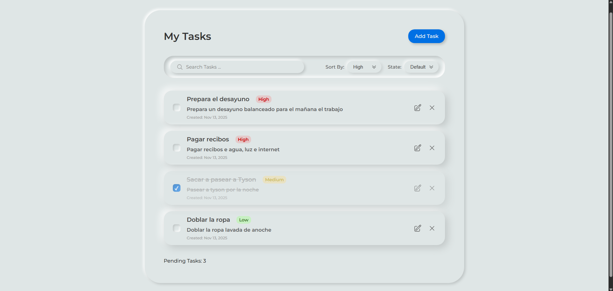
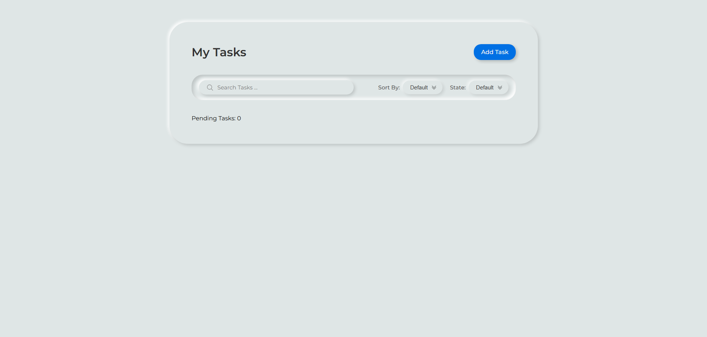
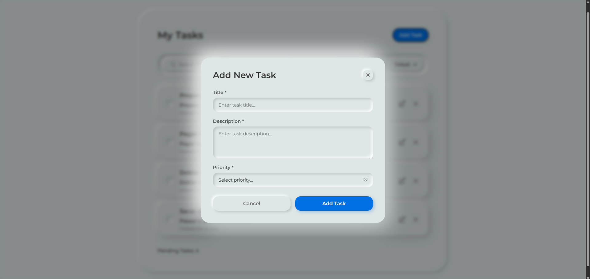
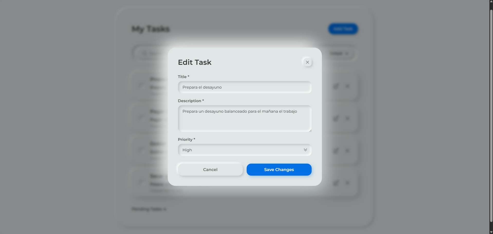
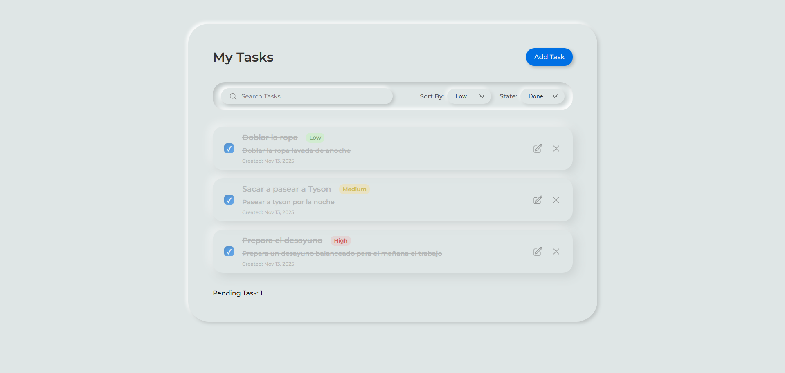
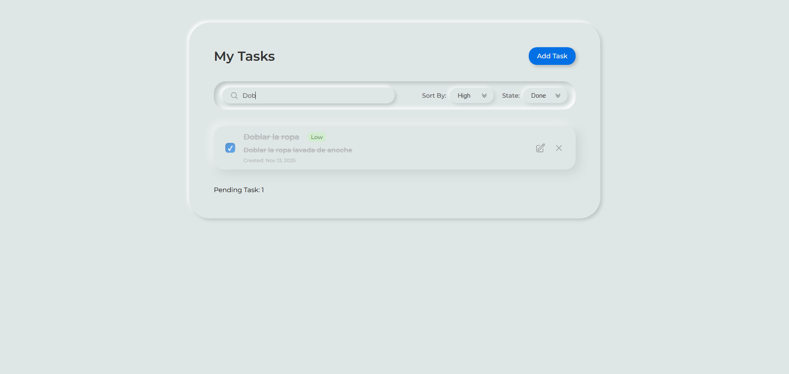

# 📝 Todo App - Task Management Application

A modern, feature-rich task management application built with TypeScript and Vite. This project implements a complete CRUD system with advanced filtering, sorting, and search capabilities, demonstrating professional development practices and clean architecture.



## 🌟 Features

### Core Functionality
- ✅ **Full CRUD Operations**: Create, Read, Update, and Delete tasks
- ✅ **Task Properties**: Title, description, priority levels (High, Medium, Low)
- ✅ **Task Status**: Mark tasks as completed/pending with visual feedback
- ✅ **Persistent Storage**: Data saved in localStorage for persistence across sessions

### Advanced Features
- 🔍 **Real-time Search**: Search tasks by title or description with instant results
- 🎯 **Smart Filtering**: Filter by status (All, Completed, Pending)
- 📊 **Priority Sorting**: Sort tasks by priority using distance-based algorithm
- 🔢 **Dynamic Counter**: Real-time pending tasks counter
- 🎨 **Modal Interface**: Clean modal for creating and editing tasks
- ⚡ **State Management**: Filters work together seamlessly (search + filter + sort)

### Technical Highlights
- 🏗️ **Modular Architecture**: Separation of concerns with dedicated classes
- 🎯 **Event Delegation**: Efficient DOM event handling
- 🔄 **State Synchronization**: Filters persist across user interactions
- 📱 **Responsive Design**: Works on desktop and mobile devices
- 🎨 **Modern UI**: Clean, intuitive interface with smooth interactions

## 🖼️ Screenshots

### Main Interface

*Clean and intuitive task list with priority badges*

### Create Task Modal

*Modal for adding new tasks with validation*

### Edit Task

*Edit existing tasks with pre-filled data*

### Filtering System

*Advanced filtering and sorting options*

### Search Functionality

*Real-time search across tasks*

## 🛠️ Tech Stack

### Core Technologies
- **TypeScript** - Type-safe JavaScript with modern features
- **Vite** - Fast build tool and development server
- **HTML5** - Semantic markup
- **CSS3** - Modern styling with custom properties

### Development Tools
- **Git** - Version control
- **npm** - Package management
- **ES Modules** - Modern JavaScript module system

### Architecture
- **Object-Oriented Programming** - Class-based architecture
- **MVC Pattern** - Separation of Model, View, and Controller concerns
- **localStorage API** - Client-side data persistence
- **Event Delegation** - Efficient event handling pattern

## 📦 Installation

### Prerequisites
- Node.js (v14 or higher)
- npm or yarn

### Steps

1. **Clone the repository**
```bash
git clone https://github.com/DanielLubo/ToDo-TypeScript.git
cd todo-app
```

2. **Install dependencies**
```bash
npm install
```

3. **Run development server**
```bash
npm run dev
```

4. **Open in browser**
```
Navigate to http://localhost:5173
```

5. **Build for production**
```bash
npm run build
```

## 🚀 Usage

### Creating a Task
1. Click the **"Add Task"** button
2. Fill in the task details:
   - Title (required)
   - Description (required)
   - Priority (High/Medium/Low)
3. Click **"Add Task"** to save

### Editing a Task
1. Click the **edit icon** (pencil) on any task
2. Modify the task details
3. Click **"Save Changes"**

### Completing a Task
- Click the checkbox to mark a task as completed
- Click again to mark as pending

### Deleting a Task
1. Click the **delete icon** (trash) on any task
2. Confirm the deletion

### Filtering Tasks
- Use the **"State"** dropdown to filter:
  - **Default**: Show all tasks
  - **Done**: Show only completed tasks
  - **To Do**: Show only pending tasks

### Sorting Tasks
- Use the **"Sort By"** dropdown to sort:
  - **Default**: Original order (by creation date)
  - **High**: High priority tasks first
  - **Mid**: Medium priority tasks first
  - **Low**: Low priority tasks first

### Searching Tasks
- Type in the search bar to filter tasks in real-time
- Searches both title and description
- Case-insensitive matching

### Combined Filters
All filters work together:
- Example: Search "typescript" + Filter "Done" + Sort "High"
- Results update automatically as you type or change filters

## 📁 Project Structure

```
todo-app/
├── src/
│   ├── app/
│   │   ├── app.ts              # Main orchestrator class
│   │   └── components/
│   │       ├── TodoList.ts     # Task list rendering
│   │       └── TodoModal.ts    # Modal UI logic
│   ├── models/
│   │   └── TodoManager.ts      # Business logic & data management
│   ├── services/
│   │   └── localStorage.ts     # localStorage operations
│   ├── types/
│   │   └── todo.types.ts       # TypeScript interfaces & types
│   ├── styles/
│   │   └── style.css           # Application styles
│   └── main.ts                 # Application entry point
├── public/
│   └── index.html              # HTML template
├── package.json
├── tsconfig.json
├── vite.config.ts
└── README.md
```

### Architecture Overview

**App (Orchestrator)**
- Coordinates all components
- Manages application state
- Handles user interactions

**TodoManager (Model)**
- CRUD operations
- Business logic
- Data validation

**TodoList (View)**
- Renders task list
- Generates HTML dynamically

**TodoModal (View)**
- Modal UI management
- Form validation
- Create/Edit modes

**localStorage (Service)**
- Data persistence
- Serialization/deserialization

## 🔑 Key Concepts Demonstrated

### 1. Separation of Concerns
Each class has a single, well-defined responsibility:
- `App`: Coordination and event handling
- `TodoManager`: Data operations
- `TodoList`: Rendering
- `TodoModal`: Modal UI

### 2. Event Delegation
Instead of attaching event listeners to each task, we listen on the parent:
```typescript
taskContainer.addEventListener('click', (e) => {
    const target = e.target as HTMLElement;
    if (target.closest('.tasks__btn-delete')) {
        // Handle delete
    }
});
```

### 3. State Management
Centralized state for filters ensures consistency:
```typescript
private currentFilter: string = 'default';
private currentSort: string = 'default';
private currentSearch: string = '';
```

### 4. Filter Composition
Filters are applied in sequence:
```typescript
renderTasks(): void {
    let tasks = this.todoManager.getAllTasks();
    tasks = this.applySearch(tasks);
    tasks = this.applyFilter(tasks);
    tasks = this.applySort(tasks);
    this.todoList.renderTask(tasks);
}
```

### 5. TypeScript Benefits
- Type safety prevents runtime errors
- Interfaces define clear contracts
- Enums for constants (Priority weights)
- Better IDE support and autocomplete

## 🧪 Features Explanation

### Priority Sorting Algorithm
The sorting uses a **distance-based algorithm**:
1. Tasks with selected priority appear first
2. Remaining tasks sorted by "distance" to selected priority
3. Example: Selecting "Medium" shows: Medium → Low/High → (none)

### Filter State Preservation
When you perform actions (toggle, delete), filters remain active:
- Filter to "Done" → Toggle a task → It disappears from view
- This prevents user confusion and improves UX

### Real-time Search
Search updates as you type without needing to press Enter:
- Uses `input` event listener
- Debouncing not needed for small datasets
- Case-insensitive matching

## 🚀 Future Enhancements

### Planned Features
- [ ] **Animations**: Smooth transitions for task actions
- [ ] **Dark Mode**: Toggle between light/dark themes
- [ ] **i18n Support**: Multi-language support (English/Spanish)
- [ ] **Drag & Drop**: Reorder tasks by dragging
- [ ] **Due Dates**: Add deadlines to tasks
- [ ] **Categories/Tags**: Organize tasks with custom tags
- [ ] **Export/Import**: Save tasks to JSON file
- [ ] **Task Notes**: Add detailed notes to tasks
- [ ] **Subtasks**: Break down tasks into smaller steps
- [ ] **Statistics**: Visual charts of task completion

### Technical Improvements
- [ ] Unit tests with Vitest
- [ ] E2E tests with Playwright
- [ ] Better error handling
- [ ] Accessibility improvements (ARIA labels)
- [ ] PWA support (offline functionality)
- [ ] Backend integration (optional)

## 🎓 Learning Outcomes

This project demonstrates proficiency in:
- ✅ TypeScript fundamentals and advanced types
- ✅ Object-Oriented Programming in JavaScript
- ✅ DOM manipulation and event handling
- ✅ localStorage API usage
- ✅ Modular architecture design
- ✅ Git workflow and commit best practices
- ✅ Modern build tools (Vite)
- ✅ Responsive design principles
- ✅ Clean code and documentation

## 👨‍💻 Author

**Daniel** - Full Stack Developer in Training

- GitHub: [@DanielLubo](https://github.com/DanielLubo)
- LinkedIn: [Daniel Felipe Lubo Realpe](https://www.linkedin.com/in/danilubo/)

## 🙏 Acknowledgments

- Inspired by modern task management applications
- Built as a learning project to master TypeScript and architectural patterns
- Thanks to the developer community for best practices and guidance

---

⭐ **If you found this project helpful, please consider giving it a star!** ⭐

---

### 📊 Project Stats

- **Lines of Code**: ~1,200
- **Development Time**: Multiple sessions over several days
- **Commits**: 20+ with meaningful messages
- **Features**: 10+ major functionalities
- **Architecture**: Modular OOP design
